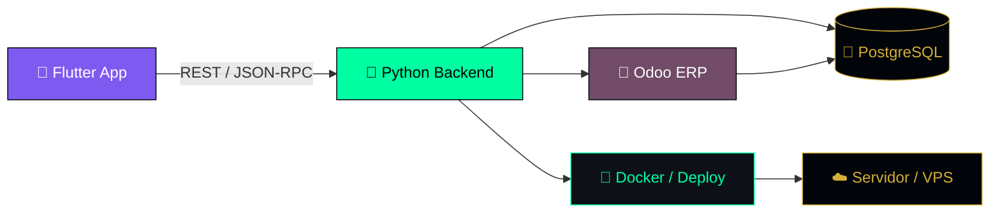

<div align="center">
  
</div>

<h3 align="center">
  <a href="https://git.io/typing-svg">
    
  </a>
</h3>

<div align="center">

[](https://linkedin.com/in/gelson-do-souto)
[](https://www.youtube.com/@mr_odoo)
[](https://gelson-do-souto-portifolio.vercel.app/)
[](https://instagram.com/gelson_do_souto)

</div>

<br/>

<div align="center">
  
  
  
</div>

---

## 🧠 Sobre Mim

```yaml
role: "Backend Engineer & Odoo Architect"
stack_core: [Python, PostgreSQL, Odoo ERP, Docker, REST/JSON-RPC APIs]
mobile: [Flutter, Dart]
mission: >
  Desenho e construo sistemas backend robustos e escaláveis — 
  do modelo de dados à API — com foco em automação de processos 
  empresariais e integrações Odoo de alta performance.
location: "Talatona, Luanda 🇦🇴"
```

Especialista em **arquitetura de módulos Odoo**, modelagem de dados em **PostgreSQL** e construção de **APIs** que sustentam aplicações móveis em **Flutter**. Transformo requisitos de negócio complexos em sistemas backend confiáveis, seguros e prontos para escalar.

---

## ⚙️ Tech Arsenal

<table align="center" border="0">
  <tr>
    <td align="center" valign="top" width="25%">
      <b>🖥️ Backend</b><br/><br/>
      <br/>
      <sub>Python · PostgreSQL · APIs</sub>
    </td>
    <td align="center" valign="top" width="25%">
      <b>🧩 ERP / Odoo</b><br/><br/>
      <br/>
      <br/>
      <sub>Módulos custom · JSON-RPC · OWL</sub>
    </td>
    <td align="center" valign="top" width="25%">
      <b>📱 Mobile</b><br/><br/>
      <br/>
      <sub>Flutter · Dart</sub>
    </td>
    <td align="center" valign="top" width="25%">
      <b>🐳 DevOps</b><br/><br/>
      <br/>
      <sub>Docker · Linux · CI/CD</sub>
    </td>
  </tr>
</table>

---

## 🏗️ Arquitetura Típica de Projeto



---

## 📊 Estatísticas de Desenvolvedor

<div align="center">
  
  
</div>

<div align="center">
  
</div>

<div align="center">
  
</div>

---

## 🐍 Activity Map

<div align="center">
  
</div>

---

<div align="center">
  
  <br/><br/>
  <sub>💬 Aberto a colaborações em <b>Odoo</b>, integrações backend e projetos Flutter escaláveis.</sub>
  <br/><br/>
  
</div>
