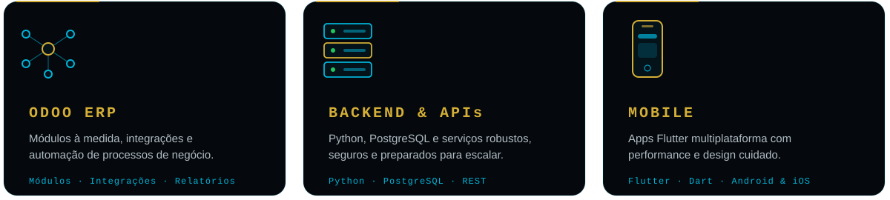
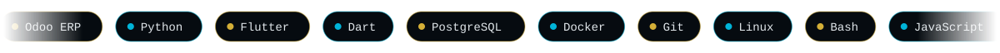
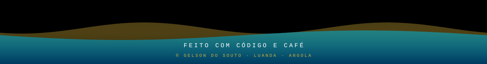

 

### `> SOBRE MIM`

Programador backend em <b>Luanda</b>, focado em transformar requisitos de negócio complexos em sistemas simples de usar e fáceis de manter.

### `> O QUE FAÇO`

### `> STACK`

<b>🧰 Ver stack completa</b> (clica para abrir)

 

**ERP e backend**

**Mobile**

**Ferramentas**

### `> PROJECTOS EM DESTAQUE`

<!-- Substitui pelos teus projectos reais (3 ou 4). Para cartões automáticos, ver o fim deste ficheiro. -->

<b>📌 Selecção</b>

 

| Projecto | O que faz | Stack |
| :-- | :-- | :-- |
| **[Nome do projecto 1](https://github.com/Gelson-do-Souto/REPO)** | Uma frase sobre o problema que resolve | `Odoo` `Python` |
| **[Nome do projecto 2](https://github.com/Gelson-do-Souto/REPO)** | Uma frase sobre o problema que resolve | `Flutter` `Dart` |
| **[Nome do projecto 3](https://github.com/Gelson-do-Souto/REPO)** | Uma frase sobre o problema que resolve | `Python` `PostgreSQL` |

### `> VAMOS CONVERSAR`

Precisas de um sistema <b>Odoo à medida</b>, de uma <b>API</b> ou de uma <b>app móvel</b>?

<!--
CARTÕES DE PROJECTO AUTOMÁTICOS (opcional):
Troca a tabela acima por isto, com o nome real de cada repositório.

-->
